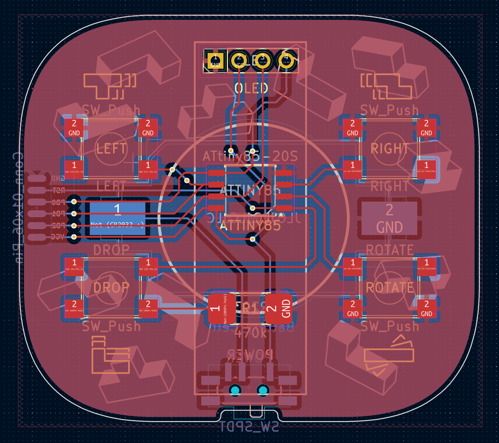
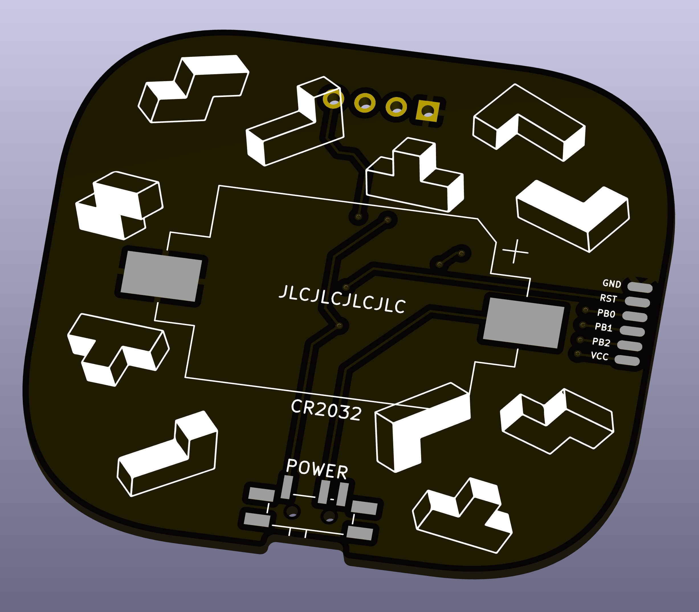

# attiny-tetromino 

This is my second-ever PCB, an Arduino Tetris game based around a attiny85. Most of the code was inspired by this hack https://github.com/jfoucher/attiny-tetris/ — however I made a number of modern modifications to Tetris (7-bag randomiser, DAS, debounce, NES speed improvements, new level and line system, new fonts). 

I started with a breadboard and then thought I'd try my hand at designing a PCB in Kicad. Here's [version 1](https://www.reddit.com/r/arduino/comments/1eph7te/my_first_pcb_an_arduino_attiny85_handheld/) and this project is version 2. Please excuse my poor hand soldering, as I'm only just beginning!

The game is quite small, at 50x44mm it's easily pocketable. The side profile is only 14mm, and could be make thinner by using a smaller battery holder.

## How to build your own

### Part list

The parts are relatively inexpensive, with the entire BOM and board costing less than $10 in total. To accomodate easier soldering I've selected larger surface mount components where possible, and the pads on the board are also wider.

- 1x attiny85-20su
- 1x SDD1306 monochrome OLED (128x32 pixels)
- 1x Mini 7-pin SMD toggle slide switch, [SPDT MSK-12C02](https://www.ckswitches.com/media/1424/pcm.pdf) 
- 4x SMD micro-switch 6x6x5mm
- 1x 470k SMD resistor (2512 size)
- 1x battery holder CR2032, [Keystone 1060](https://www.ckswitches.com/media/1424/pcm.pdf)

### Make the PCB

Order a PCB using the gerber files within the `pcb/fabrication` folder — simply zip this up and process the files through your favourite prototyping fab. The source also includes the Kicad project if you'd like to modify the PCB, components, or even just the silkscreen graphics.

### Programming the board

The board includes 6 programming pads directly connected to the attiny. You can see them here on the right-hand side of the rear of the pcb; 

These can be easily connected using a SOP16 programming clip for SOIC16 chips. Only the top section of the clip is used, and is mapped to GND, RST, PB0, PB1, PB3, and VCC. Connect the programming clip to your programming device or Arduino using DuPont jumper wires — learn more at [SOICBite](https://github.com/SimonMerrett/SOICbite)

Once the board is connected, load up the Arduino IDE and test the connection by burning the bootloader to the attiny. The bootloader configuration is defined within the `attiny_tetromino.ino` project.

If the bootloader completes without issue, you can now compile and upload the `attiny_tetromino.ino` project to your board. Pop in a CR2032 battery and enjoy playing!
